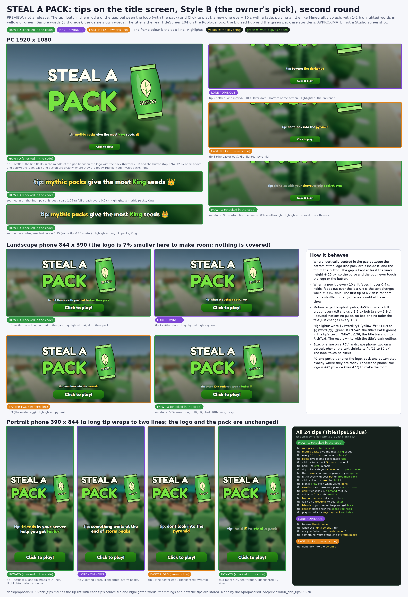

# R156 preview: tips on the title screen (Style B, second round)

Owner: "add tips in the starting screen too somewhat like minecraft with tips like rarer packs give higher loot or mythic packs give a higher chance of a king seed and so on".
Style B (a rotating "tip:" line) was picked. Second round, from the owner's review: the line floats in the **middle** (between the logo and the button), a new tip every **10 s**, a gentle
Minecraft-style **pulse**, **highlighted words**, and all tips in simple 3rd-grade words using the game's own words.

This is a **preview, not a release**, and an **approximate preview, not a Studio screenshot** (see "How the preview is made").
Nothing under `src/` is changed; the change is described below and the preview runs it on scratch copies.



`title_tips.png` shows Style B on a PC (1920 x 1080), a landscape phone (844 x 390) and a portrait phone (390 x 844). Each size shows 3 different tips with their highlights (a how-to, a lore line, the easter egg)
and a frame in the middle of a fade; the PC also shows two pulse frames (the line at its largest, +5%, and its smallest, -5%). The frame colour is the tip's kind. The whole list is on the sheet too.

## Style B: how it behaves

| What | Value |
| --- | --- |
| Position | **vertically centred in the gap** between the bottom of the logo (the pack art is inside the logo's box) and the top of the button. The gap is kept at least the line's height + 20 px, so the pulse and the bob never touch the logo, the pack or the button |
| The label | one `TextLabel` ("TipLine") in the title's `CanvasGroup`: a pale "tip:", then the tip in white with the title's dark outline (so it reads on the blurred hub), Fredoka One, RichText |
| Change | a new tip every **10 s**: fades in over **0.4 s**, holds, fades out over the last **0.4 s**; the text changes while it is invisible |
| Order | the first tip of a visit is random, then a shuffled order (every tip shows once before any repeats), so a new random tip each time the title shows |
| Pulse | a continuous splash pulse about the line's centre: size **+-5%** (a sine, 0.95 to 1.05), a full breath every **0.5 s** |
| Bob | a very small bob: **+-1.5 px**, slowly (a full cycle every 1.9 s) |
| Reduced Motion | **no pulse, no bob, no fade**: the text just changes every 10 s. Checked on the mock: the scene asserts alpha 1, scale 1 and bob 0 in every frame |
| Highlights | 1-2 words per tip in yellow `#FFE14D` or green `#77E542` (the title's PACK green), see "How the tips are stored" |
| Size | one line on a PC / landscape phone, up to two lines on a portrait phone; the text shrinks to fit (`TextScaled`, 11 to 32 px). All 24 tips fit all three sizes (checked) |
| Clicks | the label is not active: it never takes the click meant for the button; it fades in with the title and out when the player clicks |

Layout (what `T.Layout` returns, from the real code on the mock; the line is centred in the gap):

| Screen | Logo (with the pack) | Gap, logo bottom to button top | Tip line | Air above / below the line |
| --- | --- | --- | --- | --- |
| PC 1920 x 1080 | 1160 x 653, **unchanged** | 185 px (791 to 976) | up to 32 px, one line, 41 px tall | 72 px each side |
| Landscape phone 844 x 390 | **443 x 250 (was 477 x 269, 7% smaller)** to make room | 43 px (276 to 319) | 16 px, one line, 23 px tall | 10 px each side |
| Portrait phone 390 x 844 | 355 x 200, **unchanged** | 277 px (463 to 740) | up to 25 px, two lines, 62 px tall | 107 px each side |

Only the landscape phone loses a little logo size; everywhere else the room was already there. No overlap, checked in the rendered pages (`preview/check_tip_fit156.mjs`): the line's box grown by the pulse (+5%) and the bob (1.5 px)
stays at least 4 px clear of the logo's box and of the button grown by its hover scale (3.5%); the worst case is the landscape phone: 9 px above, 6 px below. It is centred to within the bob.

The code change (all in `src/ReplicatedStorage/TitleScreen104.lua`, not applied here): `T.Layout` keeps a gap of at least `tipHeight + 20` above the button and returns `TipY` (the middle of that gap), `TipWidth`, `TipHeight`, `TipSize`;
`T.Start` builds the label (with a `UITextSizeConstraint`, a `UIStroke` and a `UIScale` for the pulse) in a `task.spawn`, so a missing list can never block the title, and resizes it with the layout;
the frame step moves the tip clock, the fade, the pulse and the bob. `preview/patch_title156.py` writes that scratch copy and the exact diff.

## The tips (24)

Rewritten in simple words (3rd grade, about 8 words or fewer, "you" / "your" in full), with the game's own words (pack, seed, King, Mythic, steal, treadmill, shovel, bat, keeper, market, fruit, garden, the darkened, mystery pack) and the owner's casual lowercase voice, with "you" and "your" written in full (the owner's later change from "u" / "ur").
Numbers only where players see them in the game (10th, 5 times, x3, x6). (The quoted game strings in the "Checked in" column, like "sell ur crops", are the game's own text, left as written.) Groups: **how-to** (a real game fact, checked in the code; source files below), **lore / ominous** (teasing, no mechanics invented), **easter egg** (the owner's line, exactly as given).
`{y}` is yellow, `{g}` is green in the Highlighted column.

### How-to (19, each checked against this checkout)

| # | Tip (as players read it) | Highlighted | Checked in |
| --- | --- | --- | --- |
| 1 | rare packs = better seeds | {y} rare packs, {g} better seeds | `PackOdds137.lua` (PackFloor, PackTopLuck, MidOneIn), `SeedPackRules.lua` (PackTiers, Pack01..Pack06). On the real odds, in every biome a better pack never has a worse floor, and a Mythic pack never gives less than Legendary |
| 2 | mythic packs give the most King seeds 👑 | {y} mythic packs, {g} King | `PackOdds137.lua` (King 1 in 1T divided by PackTopLuck 1 / 2.5 / 6 / 20 / 60 / 200). On the real odds (with the 80% rule) the King chance rises with every pack tier in **all five biomes that have a King seed** (Desert, Snow, Lava, Crystal, Storm Peaks); the Mythic pack is best in each. Forest and Jungle have no King seed. Desert: 1.4e-10% (Common pack) up to 2e-8% (Mythic pack) |
| 3 | every 10th pack you open is lucky! 🍀 | {y} 10th pack, {g} lucky | `PackPity155.lua` (Every=10, "LUCKY PACK! x1.5 luck"), `BalanceValues81.lua` (LuckyPackBoost=1.5), `PackPityData155.lua` / `PlayerDataService.lua` (the server opens it). The count is per group: normal packs, and Void / Verity / Mech packs on their own (the purple pity bar), so the tip is about the pity bar the player sees |
| 4 | boots give biome packs more luck | {y} boots, {g} luck | `BalanceValues81.lua` (BootLuck), `Config.lua` (Sand / Frost / Lava / Crystal / Thunder Boots; LuckMultiplier set from BootLuck). Void / Verity / Mech packs ignore boots (`SeedPackRules.lua`, R154 comment), hence "biome packs" |
| 5 | click or tap a pack 5 times to open it | {y} 5 times | `SeedPackRules.lua` (OpenClicks=5), `ChestService.lua` (pack tooltip "Click / tap / RT 5 times to open") |
| 6 | hold E to steal a pack | {y} E, {g} steal | `Config.lua` (StealHoldSeconds=1), `MapService.lua` (prompt "STEAL", HoldDuration), `BeginnerGuide.lua` (E on a keyboard) |
| 7 | dig holes with your shovel to trip pack thieves | {y} shovel, {g} pack thieves | `TrackHoleConfig.lua` (only pack CARRIERS fall in, i.e. the thieves; "U FELL IN A HOLE! PACK DROPPED"; 3 s between digs, 4 holes each, a hole lasts 3 min, the trapped carrier is down 4 s), `TrackHoleService.lua`, `HarvestToolService.lua` (shovel tooltip) |
| 8 | the shovel can remove plants in your garden | {y} shovel, {g} garden | `HarvestToolService.lua` (tooltip "Remove a plant"), `GardenShovel.client.lua` ("Remove <plant>? ... U won't get the seed back.") |
| 9 | hit thieves with your bat to drop their pack | {y} bat, {g} drop their pack | `BatConfig.lua` ("knockback, a short stun, and stolen-pack disarm"; 1 s between swings), `BatArt.lua` (tooltip "Swing to disarm"), `BatService.lua` into `ConcurrentKeeperService.lua` `HitByBat` (ragdoll knockback from `KnockbackConfig.lua` Bat; a runner is "caught" and drops the pack). Works on the biome track (BatConfig RequireBiome) |
| 10 | click soil with a seed to plant it 🌱 | {y} seed, {g} plant | `ChestService.lua` (seed tooltip "Click or tap the soil to plant!"), `BeginnerGuide.lua` (step 4) |
| 11 | plants grow even when you're gone | {g} grow, {y} gone | `OfflineGrowthNotice.client.lua` (the owner's "Plants grow offline" line), `PlantRules.lua` + `GardenPlantRuntime.lua` (growth is read from real timestamps: MatureAt, `Rules.Growth(crop, os.time())`) |
| 12 | weather can make your plants worth more | {y} weather, {g} worth more | `WeatherTraits.lua` (Rain = Drippy x2, Blizzard = Frosted x3, Thunderstorm = Charged x5 on the price), `WeatherService.lua` (plant roll), `BalanceRules.lua` (0.2% per minute) |
| 13 | gold fruit sells x3, diamond fruit x6 💎 | {y} gold, {g} diamond | `BalanceRules.lua` (MutationMultipliers Gold 3, Diamond 6), `WeatherTraits.lua` `Price`, `PlantRules.lua` (a plant keeps its pack's coat; each fruit inherits it with a 20% chance) |
| 14 | sell your fruit at the market | {y} fruit, {g} market | `EconomyClient.client.lua` ("Go to the market to sell ur crops!"), `MarketLayout.lua` |
| 15 | fruit of the hour sells for up to x3 | {y} fruit of the hour, {g} x3 | `FruitOfHour.lua` (Min 1.5, Max 3.0, 3600 s), `PlayerDataService.lua` (the sale uses it), `MarketLayout.lua` (its pedestal) |
| 16 | walk on a treadmill to get faster ⚡ | {y} treadmill, {g} faster | `BeginnerGuide.lua` (step 5 "GET FASTER! hop on it"), `BaseService.lua` (training gain) |
| 17 | friends in your server help you get faster | {y} friends, {g} faster | `DailyRewards.lua` (FriendBoostPerFriend .10, max 3 friends), `SocialService.lua`, `BaseService.lua` (GetFriendGainMultiplier: it adds to the speed GAINED from the treadmill) |
| 18 | keeper signs show the speed you need | {y} keeper, {g} speed you need | `KeeperSpeedLabels.client.lua` ("SPEED NEEDED", green with a tick once you are faster) |
| 19 | play to unlock a mystery pack each day | {y} mystery pack, {g} each day | `MysteryPackRules.lua` (15 minutes of play unlocks today's pack, a new one every day; the pedestal stands in each base), `MysteryPackService.lua` |

### Lore / ominous (4, no mechanics claimed)

| # | Tip | Highlighted | Grounding |
| --- | --- | --- | --- |
| 20 | beware the darkened | {y} the darkened | The Darkened is the game's secret keeper (`KeeperRigConfig152.lua` stage 0, `VeiledEvent81.lua`, `VerityConfig.lua`) |
| 21 | when the lights go out... run | {y} lights go out | `BiomeMood.lua` (R127: The Darkened's arrival turns the lights off) |
| 22 | are you faster than the darkened? | {y} the darkened | a tease about the speed idea the keeper signs already show (`KeeperSpeedLabels.client.lua`: its sign says "SPEED NEEDED" and "infinity"); no number or rule claimed |
| 23 | something waits at the end of storm peaks | {y} storm peaks | `VerityConfig.lua` (the quest places The Darkened "at the end of Storm Peaks") |

### Easter egg (1)

| # | Tip | Highlighted | Note |
| --- | --- | --- | --- |
| 24 | dont look into the pyramid | {y} pyramid | the owner's line, exactly as given; no game fact is claimed (Desert has a "Sunscar Pyramid" landmark, `Config.lua`, if he wants to hook it up) |

## Ideas not used, and why

None of the candidates was flat-out false, but some were wrong as first worded or not safe to ship:

- "dig holes with the shovel to trap players": only players **carrying a pack** fall in (`TrackHoleConfig.lua`), so the tip says "pack thieves".
- "gold / diamond packs grow gold / diamond plants and their fruit sells x3 / x6": the plant keeps the coat, but each fruit inherits it only 20% of the time (`BalanceRules.lua` MutationInheritance), so the tip is about gold / diamond **fruit**.
- "the faster you are, the further you get down the track": nothing in the code says that. Replaced by the keeper sign tip (#18), which is real.
- "boots boost your luck": only biome packs; Void / Verity / Mech ignore boots, so the tip says "biome packs".
- "mythic packs give a higher chance of a king seed": true, but only where a King seed exists (five biomes); noted on #2.
- "the free void pack giveaway": real today, but it is capped at 500 claims for the whole game (`VoidGiveawayRules152.lua` Cap), so the tip would become false.
- "the 4 leaf clover doubles your luck": true (`GamePassCatalog.lua`), but it is a paid pass; left out so the title never pushes anything paid.
- "the darkened's sign says ∞": true, but the symbol and the numbers (15 minutes, +10%, x2 / x3 / x5, 3 friends max) are not 3rd-grade simple; the lore line is now #22 and the numbers are gone from the tips.

Side finding, not changed: `HarvestItemInfo.lua` and `PlayerDataService.lua` fill a `MutationMultiplier` label field with Gold 2 / Diamond 3, while the price uses 3 / 6 (`BalanceRules.lua`). Nothing reads that field, so players see no wrong number; the tip uses the price.

## How the tips are stored

One list module, `ReplicatedStorage/TitleTips156` (the draft is `preview/TitleTips156.lua`), so the owner adds a tip by adding one line. The highlights are a **mini-markup in the tip's text**, not RichText tags:
`{y}word{/y}` is yellow (`#FFE14D`), `{g}word{/g}` is green (`#77E542`). `T.Rich` escapes `&`, `<` and `>` first and then turns the markup into `<font color="...">` runs, so a stray character can never break a line;
`T.Plain` strips it (for an accessible name or a length check).

```lua
local T={Interval=10,Fade=.4,Prefix='tip:',PrefixColor='#C8D9E8',
 PulseAmount=.05,PulsePeriod=.5,BobPixels=1.5,BobPeriod=1.9,
 Colors={y='#FFE14D',g='#77E542'}}
T.Tips={
 {Kind='howto',Text='{y}mythic packs{/y} give the most {g}King{/g} seeds 👑'},
 {Kind='lore',Text='beware {y}the darkened{/y}'},
 {Kind='egg',Text='dont look into the {y}pyramid{/y}'},
 -- one line per tip
}
function T.Rich(text) ... end   -- the mini-markup as RichText
function T.Plain(text) ... end  -- the text without the markup
function T.Order(random) ... end -- a shuffled order, every tip once before any repeats
function T.Line(index) ... end   -- the RichText line: the pale "tip:" then the tip with its highlights
```

`Kind` is `howto`, `lore` or `egg` (only for the owner's bookkeeping; the game shows them alike). The timings, the pulse and the bob are numbers at the top of the module, so the owner can tune them without touching the title.
The title reads the list through `pcall(require, ...)`, so a broken or missing list leaves the line out and never blocks "Click to play!".
Keep how-to tips true: if a rule changes, change its tip (the table above says which file each one depends on). `preview/check_tip_fit156.mjs` checks that the whole list fits and does not overlap anything.

## How the preview is made

`sh docs/proposals/R156/preview/run_title_tips156.sh <scratch dir>` (needs /opt/luau, python3 + Pillow, node + playwright; the font comes from npm `@fontsource/fredoka-one`).

- **Real:** the title tree. `TitleScreen104` (a scratch copy with the tip line, `patch_title156.py`) is started on the Roblox mock at each size and stepped through its own frame function at 120 fps; its letters, button, veil, layout numbers and the tip rotation, fade, pulse and bob are the game's code,
  and the GUI tree is dumped and drawn by headless Chromium. The scene asserts the pulse (1.05 and 0.95 at the two PC pulse frames), the 50% fade frame, Reduced Motion (no fade, pulse or bob), and that the line is centred and clear of the logo and the button.
- **Real:** the tip list is the draft module, and the checks (every tip fits each size; no overlap; the King-odds table, `verify_king_odds.luau` on the real `SeedPackRules` / `PackOdds137` / `PackLuck154`) run on the same code.
- **Stand-ins:** the blurred hub behind (a blurred crop of an earlier three.js hub render, `docs/proposals/R151/snow_hub.png`; the game blurs the live hub with a BlurEffect of size 18) and the green seed pack (the game draws a 3D `ViewportFrame` of the Forest pack, which the mock cannot build).
- **Approximations:** Chromium's font drawing and its TextScaled fit stand in for Roblox's (the letter size of "STEAL A / PACK" is the renderer's best fit, not measured in Studio).
- Frames: tip 1 settled at 2.5 s (pulse at scale 1), the pulse frames 0.125 s and 0.375 s later (the largest and smallest), tip 2 at 12.5 s, tip 3 at 22.5 s, and the 4th tip at 39.8 s (the fade-out half through).

Files: `title_tips.png`, `title_tips.md`, and under `preview/`: `run_title_tips156.sh`, `patch_title156.py`, `TitleTips156.lua`, `title_tips_scene156.luau`, `make_sheet156.py`, `render_gui156.mjs`, `check_tip_fit156.mjs`, `verify_king_odds.luau`.
