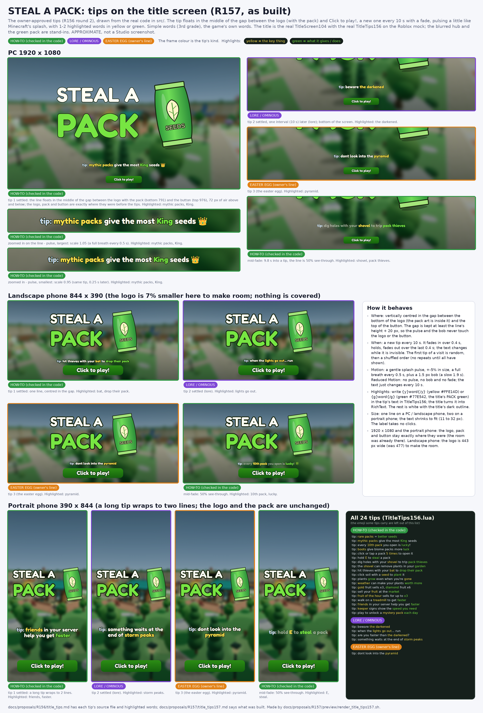

# R157: tips on the title screen (as built)

The owner approved round 2 of `docs/proposals/R156/title_tips.md`. This is what was built, from the real code. `title_tips157.png` is drawn from the real `TitleScreen104` and `TitleTips156` on the Roblox mock
(a PC 1920 x 1080, a landscape phone 844 x 390, a portrait phone 390 x 844; the blurred hub and the green pack are stand-ins; approximate, not a Studio screenshot).

## What changed

| File | Change |
| --- | --- |
| `src/ReplicatedStorage/TitleTips156.lua` (new) | the 24 tips, exactly as in the R156 .md (19 how-to, 4 lore, 1 easter egg), one line each; the `{y}..{/y}` yellow `#FFE14D` / `{g}..{/g}` green `#77E542` mini-markup turned into RichText; the timings. Adding a tip is one line |
| `src/MANIFEST.tsv` | one row for it |
| `src/ReplicatedStorage/TitleScreen104.lua` | `T.Layout` (the gap), the "TipLine" label and its clock (`stepTip`) |

`TitleScreen.client.lua` is not touched. Line 1 of the other client scripts is the R152 load guard (wait for `game.Loaded`); this script has none, on purpose: it runs in ReplicatedFirst to cover the loading,
so waiting for the game would hold the title back. It keeps doing what it did: it waits for `TitleScreen104` in ReplicatedStorage (`WaitForChild`, 20 s).

**Is `TitleTips156` there in time?** It sits in ReplicatedStorage next to `TitleScreen104`, and the title already fetches every module it needs from there with `WaitForChild` + a timeout (the title module itself, `InteractionAudio`,
`SeedPackVisuals`). The tip list is loaded the same way, in a `task.spawn` with `WaitForChild(10)` + `pcall`, so nothing had to move. If it arrives late the line appears then and fades in; if it never arrives, or its numbers or lines are
wrong, the line is left out (one warning) and "Click to play!" works as before. Checked on the mock.

## Behaviour

- One line, vertically centred in the gap between the logo (with the pack) and the button; "tip:" prefix; white text with the title's dark stroke; the label takes no input (not Active, not Interactable, not Selectable) and fades out with the title.
- A new tip every 10 s: 0.4 s fade in, 0.4 s fade out, the text changes while it is invisible. The first tip is random, then a shuffled order with no repeat until all 24 have shown (then a new shuffle that never starts with the tip just shown).
- A pulse of +-5% (a full breath every 0.5 s) and a 1.5 px bob (1.9 s). Reduced Motion: no pulse, no bob, no fade.
- One line on a PC / landscape phone, up to two on a portrait phone, shrinking to fit (TextScaled 11-32 px).
- The pulse and bob run only while the title shows (not while it leaves) and stop with it.

## Layout: the gap is at least the line's height + 20 px

| Screen | Logo width before -> now | Gap |
| --- | --- | --- |
| 1920 x 1080 | 1160 -> 1160 | 185 px (72 px of air each side of the line) |
| 390 x 844, 360 x 640, 320 x 568 | unchanged | 277, 180, 159 px |
| 844 x 390 | 477 -> 443 (7% smaller) | 43 px |
| 1366 x 768 | 1091 -> 1043 (4.4% smaller) | 51 px |

The logo only shrinks where the room was not there (also 1280 x 720: 1011 -> 966); the button never moves. The line, grown by the pulse and the bob, stays at least 5 px clear of the logo, the pack and the hovered button at every size tested (7 px on the mock's boxes, 5.7 px on the rendered page of the tightest size).

## Nothing allocated per frame

The scratch code built a `UDim2` for the bob and read `AbsoluteSize` every frame. Now the 24 RichText lines, the order and the bob's 60 positions are built once (on a resize for the positions), a property is written only when its value
changes, and the reshuffle after 24 tips refills the same table. The title's own logo line (`visual.Position=...`, older code) is left as it was.

## Tests

`sh docs/proposals/R157/tests/run_title_tips157.sh [scratch]` (also in `tools/tests/run_all_suites.sh`): static checks (the 24 tips against the R156 .md tables, the MANIFEST row, how the list is loaded, `TitleScreen.client.lua` as it was, the R152
load guard test, -O0 compile), `test_title_tips157.luau` (tips and markup, RichText, order, 10 s rotation, fade / pulse / bob numbers, Reduced Motion, six required and six more screen sizes, no input, no allocation per frame, a missing / broken /
late list) and 36 broken copies of the code that the test must catch.
The picture: `sh docs/proposals/R157/preview/render_title_tips157.sh <scratch dir>` (needs node + playwright + Pillow; it also checks that every tip fits each size and the line never overlaps anything on the rendered pages).
